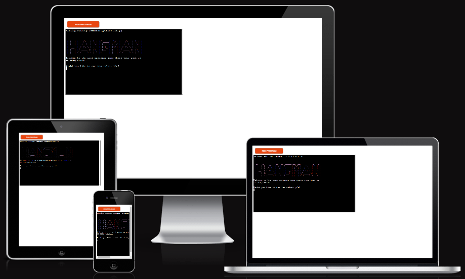
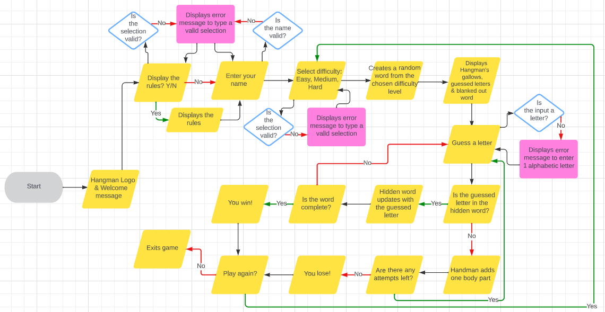

# Hangman

### [View the live page here](https://hangman-animals-16cd61b71879.herokuapp.com/)

This Hangman game is Python terminal based and run in the Code Institutes mock terminal on Heroku.

Users can play a solo game of Hangman on one of three difficulty levels, each level has additional letters per word. All words are animal names so this would be a great game for animal lovers.

## How to play

- Hangman is a classic, quick word guessing game perfect to kill some free time or learn a few new words.
- As the user you get the opportunity to choose one of three difficulty levels.
- The object of this solo game is to guess the hidden word before the stick man is hung.
- Gameplay continues until the figure has been hung (after 6 incorrect guesses) or the word has been correctly guessed, one letter at a time.

## User Experience

In this version of Hangman the user is presented with the classic game where each letter of a word is replaced with a dash (hidden word).  The user will need to guess this word one letter at a time. 

With each correct guess the dash within this word updates and displays the letter in the correct position of the hidden word.

The users goal is to guess the correct word before the game ends, this is displayed with a complete hangman stick figure as well as a message to notify the user that he/she has lost the game.

### User Stories

#### As a first time visitor I want to:
- Quickly and easily understand how the game works with a clear description of the game objective.
- Navigate the main menu and options available easily.
- Start the game, during game play to recieve messages of correct/incorrect guessed letters.
- Kill time but enjoy the game, left with the mindset of wanting to play again.

#### As a returning visitor I want to:
- Easily navigate through the menu and options available.
- Play the game again, with new words to guess and choose different difficulty levels.
- Improve my word skills and become better at guessing hidden words.
- Possibly see updated versions of the game

#### As a frequent visitor I want to:
- Easily navigate through the menu and options available.
- Have added word categories or new words updated to the game.
- Possibility or playing against another user or AI.
- Challenge myself with harder levels.

## Features

- The main screen: This displays the games name as well as the welcome message followed by an option to view the game rules.
- Game rules: These will be displayed if the user chooses to see them, if not, this step will be skipped.
- Name request: The user is requested to input their name.
- Difficulty options: The user can choose from three options, easy, medium, hard.
- Game display: The hangmans gallows is displayed, the hidden word is displayed with dashes, guessed letters are displayed. these all ghet updated throughout the progress of the game.
- Correct/Incorrect notification: This is displayed when the used guessed a correct/incorrect letetr respectively.
- Guess a letter: The user is requested to guess a single letter.
- Hidden words: These words are randomised from one of the three levels once chosen by the user.
- Play again: This option is given to the user once the game hav#s been won/lost.

### Existing Features

### Future Features

## Flowchart

## Testing

### CI Python Linter

### Python Checker

#### Testing

### Manual Testing

|What was tested|Result|
|---|---|
|||
|||
|||
|||

### Input validation Testing

### Fixed bugs

|What was tested / Expected results|Actual Results|What was done to fix the bug|
|---|---|---|
||||
||||
||||

## Deployment

### [Heroku](https://heroku.com/apps) deployment

### Cloning the GitHub repository

Cloning a repository will download a full copy of the data to your computer. This is useful when larger commits need to be pushed, adding or removing files and fixing merge conflicts.

1. Login to GitHub
2. Click the repository you wish to clone (Top left corner)
3. Click 'Code' which is shown above the list of files in the repository
4. Click the 'Local' tab, copy the HTTPS URL
5. Open Codeanywhere, click 'New Workspace'
6. Paste the copied URL into the space given under 'Repository URL'
7. Click 'Create' and the local clone will be created.

### Forking the GitHub repository

Forking a GitHub repository will allow you to make a copy of the repository, changes can then be made that will not affect the original repository. This is useful for proposed changes, ideas, fixes to an original repository.

1. Login to GitHub
2. Click the repository you wish to fork (Top left corner)
3. Click the 'Fork' drop-down in the top right-hand corner
4. Then click 'Create a new fork' you will now have a copy to work on.

## Technologies Used

## Credits

## Acknowledgements
